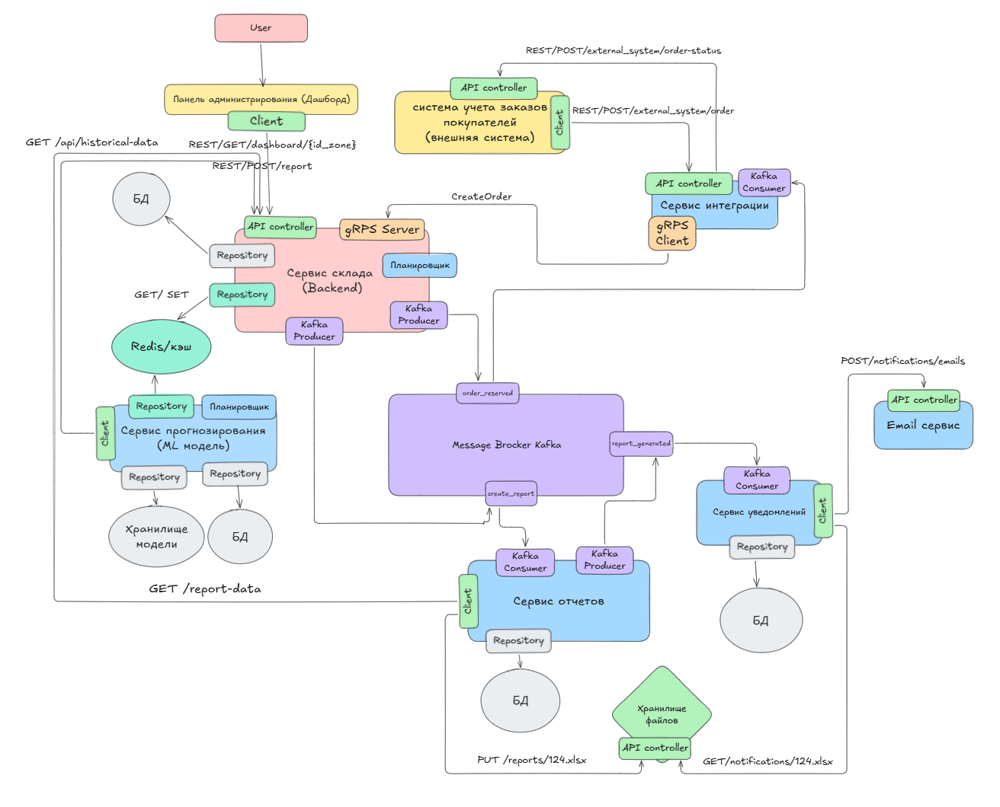
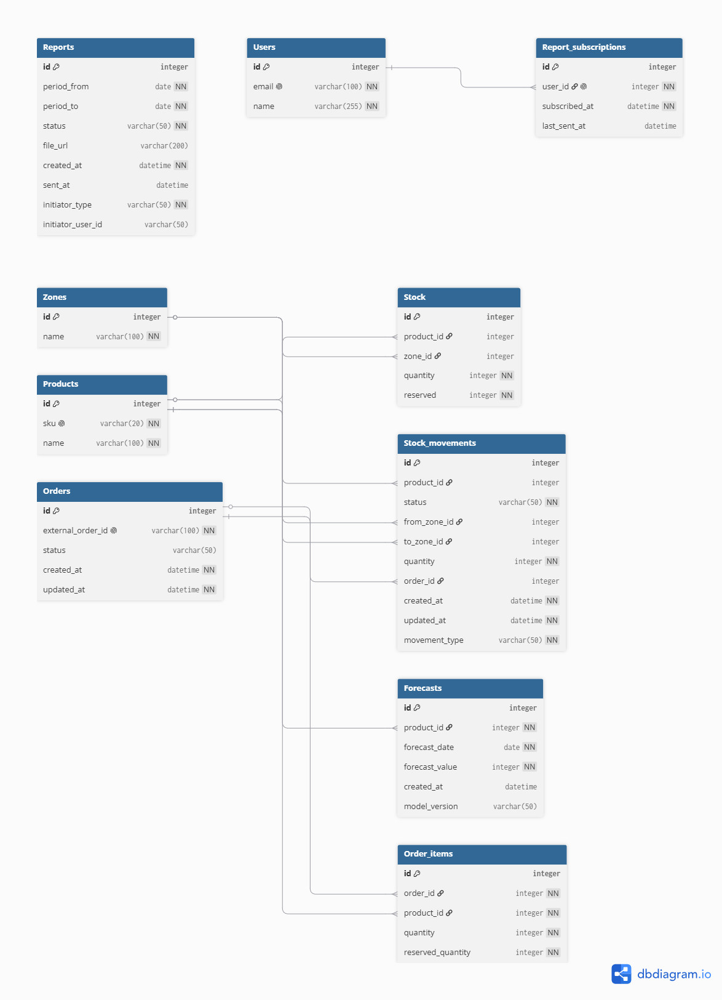

##  Разработка модуля автоматизации складского учета

Проект по системному анализу системы автоматизации складского учета.

## Цель проекта

Разработка системы для автоматизации учета товаров на складе, резервирования остатков, формирования отчетности и прогнозирования запасов.

## Моя роль

- Сбор и формализация требований
- Анализ бизнес-процессов
- Проектирование REST API
- Разработка UML Sequence Diagram
- Разработка ER-диаграммы
- Проектирование архитектуры решения

## Артефакты проекта

### Требования

[Требования](docs/requirements/requirements.md)

### Архитектура решения

### ER-диаграмма

### Диаграммы последовательностей

- Прием заказа
Диаграмма описывает процесс получения заказа от внешней системы учета заказов, проверки данных и регистрации заказа в системе управления складом.

 

- Резервирование товара

После получения заказа сервис склада проверяет наличие необходимого количества товара и выполняет резервирование. После успешного резервирования публикуется событие `order_reserved` в Kafka.

 

- Внутреннее перемещение товара

Диаграмма отражает процесс перемещения товара между складскими зонами с фиксацией изменений в системе учета.

 

### OpenAPI

[Swagger/OpenAPI документация](docs/api/warehouse-api.yaml)

Реализованные эндпоинты:

- GET /dashboard/{zoneId}
- POST /external_system/order
- POST /external_system/order-status
- POST /reports
- GET /reports/data
- PUT /reports/{reportId}.xlsx
- GET /notifications/{reportId}.xlsx
- POST /notifications/emails
- GET /forecast/historical-data
- GET /forecast/historical-data/ml-model

