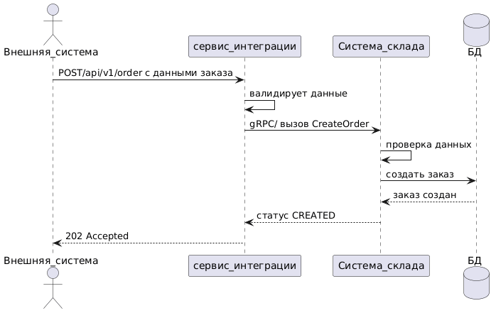
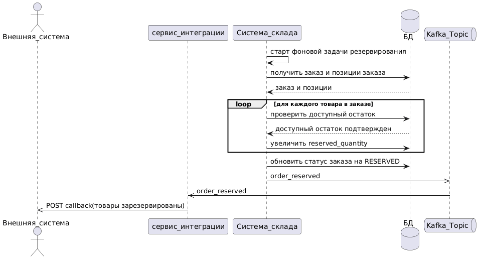
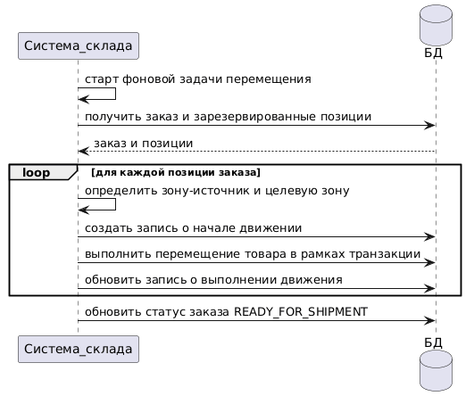

##  Разработка модуля автоматизации складского учета

Проект по системному анализу системы автоматизации складского учета.

## Цель проекта

Разработка системы для автоматизации учета товаров на складе, резервирования остатков, формирования отчетности и прогнозирования запасов.

## Моя роль

- Сбор и формализация требований
- Анализ бизнес-процессов
- Проектирование REST API
- Разработка UML Sequence Diagram
- Разработка ER-диаграммы
- Проектирование архитектуры решения

## Артефакты проекта

### Архитектура решения

### ER-диаграмма

### Диаграммы последовательностей

- Создание заказа 
 
- Резервирование товара 
 

- Внутреннее перемещение товара
 

